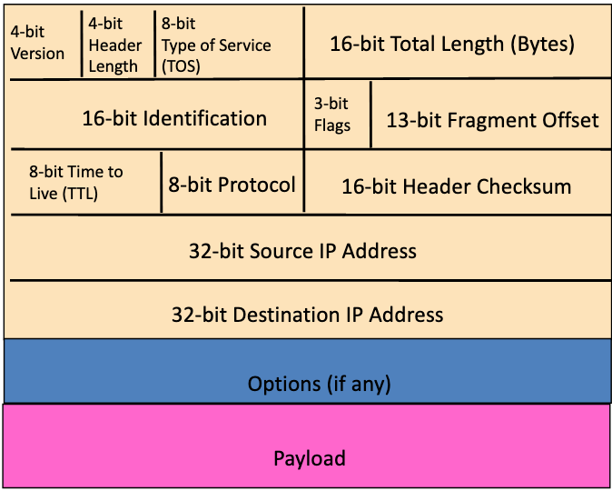

## data vs control plane

**Data plane:**
- local, per router function
- determines how datagram arriving on input port is forwarded to the output port
- forwarding function

**Control plane:**
- network-wide logic
- determines how datagram is routed along end-end path from source to destination host
- two control-plane approaches:
    - **traditional routing algorithms:** implemented per router
    - **software defined networking (SDN):** implemented by centralized server

---

## internet protocol

### packet structure


**Version number (4 bits):**
- indicates version of IP
- necessary to know what other fields to expect
- typically 4 for IPv4

**Header length (4 bits):**
- number of 32-bit words in the header
- typically 5 (20-byte headers)
- can be more when more options are used

**Total length (16 bits):**
- Number of bytes in package
- Maximum size is 2^16 - 1
- ... though links might impose smaller limits

**Protocol (8 bits):**
- identifies higher level _transport_ protocol
- used for demultiplexing at destination host

**TTL (8 bits):**
- used to solve _routing loops problem_
- decremented at each hop, packet discarded if reaches 0
- time exceeded message is sent to the source

### IP fragmentation
Network links have MTU (Max transmission unit), the largest possible link-level frame. Different link types have different MTUs.

Large IP datagram becomes several datagrams and reassembled only at the final destination.

IP header bits are used to identify and order related fragments.

**fragmentation procedure:**
- router breaks up datagram in size that output link can support
- copies IP header to pieces
- adjust length on pieces
- set offset to indicate position (8-byte blocks)
- set MF (More fragments) flag on pieces except the last
- recompute the checksum

**reassembly:**
- receiving host uses identification field with MF and offsets to complete the diagram.

### path MTU discovery procedure
**Host:**
- sends a big packet to test whether all routers in path to the destination can support or not
- set DF (Don't Fragment) flag

**Routers:**
- drops the packet if it is too large (as DF is set)
- provides feedback to Host with ICMP message telling the maximum supported size = `min(MTU_1, MTU_2, ..., MTU_N)`

### special handling
"Type of service" or "differentiated services code point (DSCP)" (8 bits):
- allow packets to be treated differently based on needs
- e.g. low delay for audio, high bandwidth for bulk transfer
- has been redefined several times
- not widely used

### IP addressing

**IP address:** 32 bit identifier for host, router interface
**interface:** connection between host/router and physical link
- routers typically have multiple interfaces
- host typically has one or two interfaces (e.g. wired Ethernet, wireless 802.11)

IPs are broken into a _network_ part (high order bits) and host part (low order bits). Device interfaces with the _same network_ part of IP address can physically reach other without an intervening router.

### Masking
We can use a bitmask to obtain the higher order bits of an IP address.

The subnet mask is 255.255.255.0 which when bitwise AND'ing with an IP gives the router prefix.
```
Network mask for IP a.b.c.d
==========================
    a       b        c        d
11111111 11111111 11111111 00000000 = 255.255.255.0
^                        ^ ^      ^
|________________________| |______|
            |                 |
          network            host
```

### Classful addresses (outdated)
N = network, H = host

**Class A:**
- 0NNNNNNN.HHHHHHHH.HHHHHHHH.HHHHHHHH

**Class B:**
- 10NNNNNN.NNNNNNNN.HHHHHHHH.HHHHHHHH

**Class C:**
- 110NNNNN.NNNNNNNN.NNNNNNNN.HHHHHHHH


### Classless InterDomain Routing (CIDR)
Network portion of address has an arbitrary length.
The address format is: a.b.c.d/x where x is the number of bits in the network (incl. subnet) portion of address.

### Dynamic Host Configuration Protocol (DHCP)
DHCP allows host to _dynamically_ obtain its IP address from network server when it joins network. Host can then renew its lease on an address. Addresses can be recycled and there is support for "mobile" users who want to join/leave the network.

**Overview:**
- host broadcasts "DHCP discover" message
- DHCP server responds with "DHCP offer" message
- host requests IP address with "DHCP request" message
- DHCP server sends address "DHCP ACK" message

All messages are sent to the **ENTIRE** network, the host can identify messages for itself via MAC addresses.

**DHCP can also return:**
- address of first-hop router for client
- name and IP address of DNS server
- network mask

**Longest prefix matching**
When looking for a forwarding table _entry_ for a given destination address, use the _longest_ address prefix that matches destination address.

**More**
IP addresses are allocated as blocks and have geographical significance. It is possible to determine the geographical location of an IP address.

### Private addresses
**Defined in RFC 1918:**
- 10.0.0.0/8
- 172.16.0.0/12
- 192.168.0.0/16

These addresses cannot be routed, anyone can use them and are typically used for NAT.

### Network Address Translation (NAT)
**All** datagrams **leaving** local network have the _same_ single source NAT IP address, with different source port numbers.

**Implementation - NAT router must:**
- ***replace*** `(source IP, port #)`of every outgoing datagram to `(NAT IP, new port #)` ... remote clients will respond using the latter as the destination address, and NAT router will do the same **in reverse**.
- ***remember*** (in NAT translation table) every `(source IP, port #)` to `(NAT IP, new port #)` translation pair

**NAT advantages:**

Local network uses just one IP address as far as outside world is concerned (abstraction!). Therefore:
- range of addresses not needed from ISP: just one IP for all devices by using 16-bit port numbers
- can change addresses of devices in local network without notifying outside world
- can change ISP without changing addresses of devices in local network

**NAT disadvantages:**

- It violates the architectural model of IP (every IP addr uniquely identifies a single node on Internet)
- NAT changes the Internet from connection less to a kind of connection-oriented network
- NAT possibility must be taken into account by app designers, e.g. P2P applications

**NAT issues:**

- Due to modification of port # and IP addr, it requires a **recalculation** of TCP and IP checksum
- Some applications embed IP address or port numbers in their message payloads
    - DNS, FTP, SIP
    - For legacy protocols, NAT must look into these packets and translate the embedded IP addresses/port numbers
    - What if the fields are encrypted??
- E.g. if applications change port numbers periodically, the NAT router must be aware of this
- **NAT traversal problems**
    - How to setup a server behind a NAT router?
    - How to talk to a Skype user behind a NAT router?

**NAT traversal problem**
_Example problem:_
- Client wants to connect to server with address 10.0.0.1
- Server addr 10.0.0.1 local to LAN (client can't use as destination addr)
- only one externally visible NAT'd addr: 138.76.29.7

**Solution 1: Inbound NAT**
Statically configure NAT to forward incoming connection requests at given port to server
- E.g. `(138.76.29.7, port 2500)` always forwarded to `(10.0.0.1, 25000)`

**Solution 2: Universal Plug and Play (UPnP) Internet Gateway Device (IGD) Protocol**
Allows NAT'd host to:
- Learn public IP address (138.76.29.7)
- Add/remove port mappings (with lease times)

**Solution 3: relaying (used in Skype)**
- NAT'd client establishes connection to relay
- external client connects to relay
- relay bridges packets between two connections
